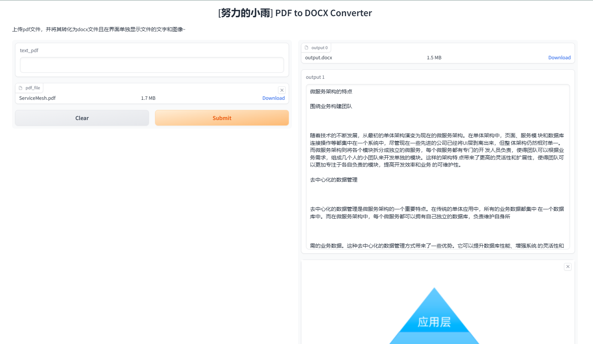

# pdf2docx_with_ui
上传pdf文件，并将其转化为docx文件且在界面单独显示文件的文字和图像~

# 环境
Python 3.10.*

# 项目运行
`pip install -r requirements.txt`

`python pdf2docx.py`

# 演示效果

# 关于我
我的个人主页：https://link3.cc/studiousxiaoyu

我只是一名普通打工人,热衷分享技术和开发AI工具，如果你对Java、Python开发、AI人工智能有兴趣，欢迎关注我的【灵墨AI探索室】公众号。

